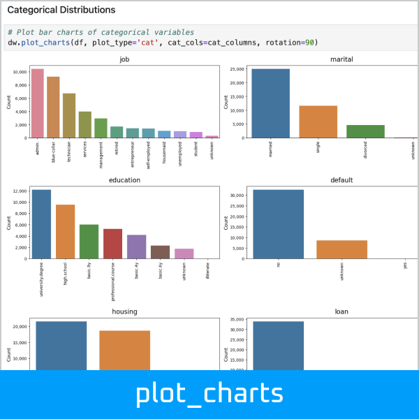
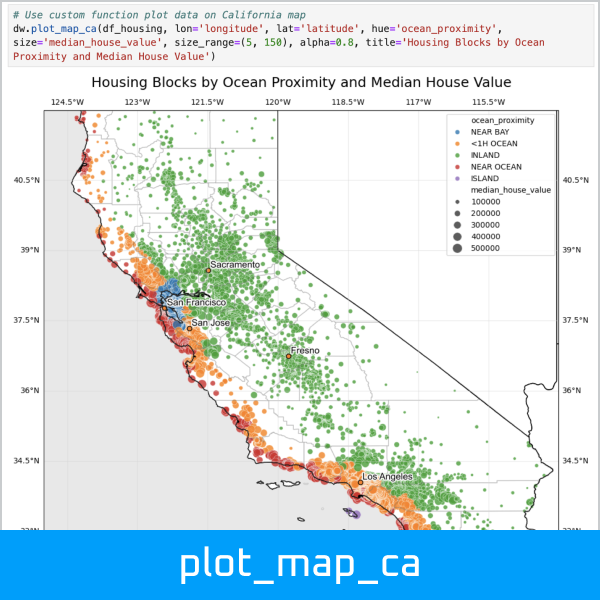
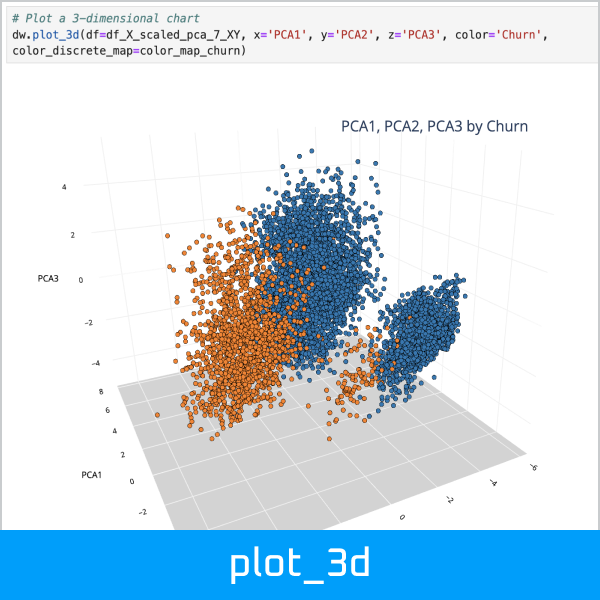
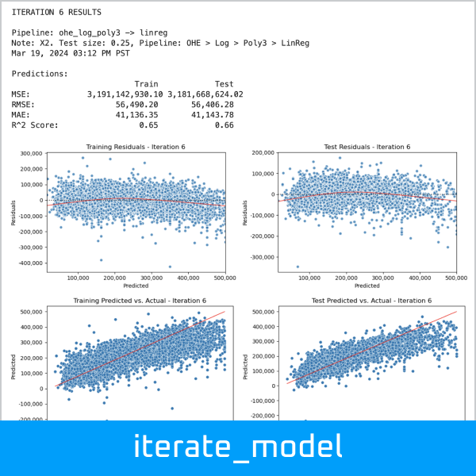
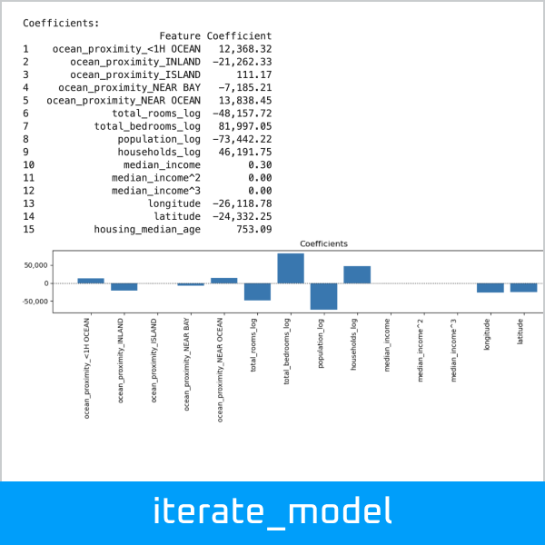
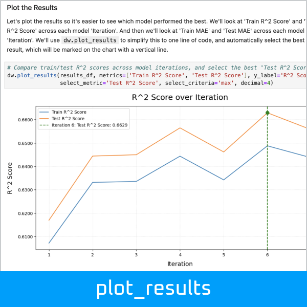
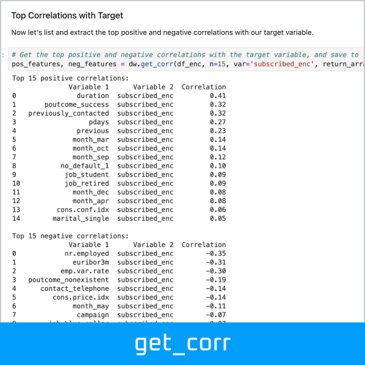
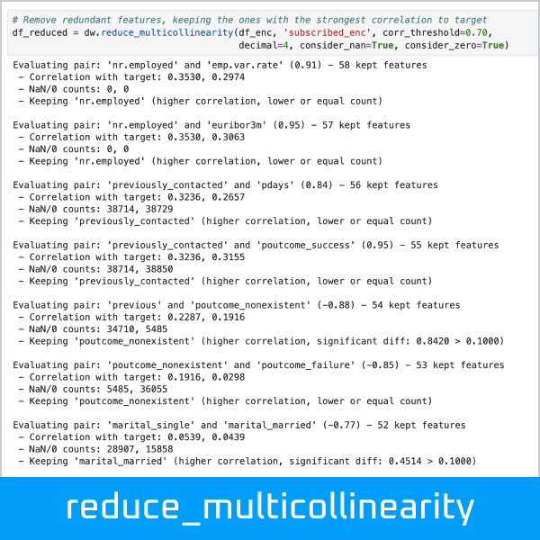
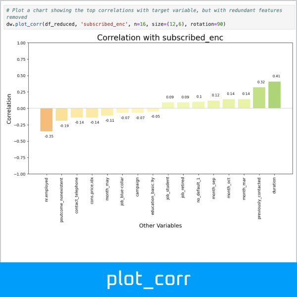

 

--------------------------------------

Datawaza streamlines common Data Science tasks. It's a collection of tools for data exploration, visualization, data cleaning, pipeline creation, hyper-parameter searching, model iteration, and evaluation. It builds upon core libraries like [Pandas](https://pandas.pydata.org/), [Matplotlib](https://matplotlib.org/), [Seaborn](https://seaborn.pydata.org/), and [Scikit-Learn](https://scikit-learn.org/stable/).

  
  
  

  
  
  

  
  
  

Documentation
-------------

Online documentation is available at [Datawaza.com](https://datawaza.com).

The [User Guide](https://www.datawaza.com/en/latest/userguide.html) is a Jupyter notebook that walks through how to use the Datawaza functions. It's probably the best place to start.

There is also an API reference for the major modules: [Clean](https://www.datawaza.com/en/latest/clean.html), [Explore](https://www.datawaza.com/en/latest/explore.html), [Model](https://www.datawaza.com/en/latest/model.html), and [Tools](https://www.datawaza.com/en/latest/tools.html).

Installation
------------

The [latest release](https://pypi.org/project/datawaza/) (and required dependencies) can be installed from PyPI:

    pip install datawaza

I suggest creating a new environment to test it out, since it will download a number of libraries.

Quick Start
-----------

The [User Guide](https://www.datawaza.com/en/latest/userguide.html) will show you how to use Datawaza's functions in depth. Assuming you already have data loaded, here are some examples of how you might use some functions during data analysis and modeling:

    import datawaza as dw
    
Show the unique values of each variable below the threshold of n = 12:

    dw.get_unique(df, 12, count=True, percent=True)

Plot bar charts of categorical variables, dimensioned by the target variable:

    dw.plot_charts(df, plot_type='cat', cat_cols=cat_columns, hue='y', rotation=90)

Get the top positive and negative correlations with the target variable, and save to lists:

    pos_features, neg_features = dw.get_corr(df_enc, n=15, var='subscribed_enc', return_arrays=True)

Plot a chart showing the top correlations with the target variable:

    dw.plot_corr(df_enc, 'subscribed_enc', n=16, size=(12,6), rotation=90)

Run a model iteration, which dynamically assembles a pipeline and evaluates the model, including
charts of residuals, predicted vs. actual, and coefficients:

    results_df, iteration_1 = dw.iterate_model(X_train, X_test, y_train, y_test,
        transformers=['ohe', 'log', 'poly3'], model='linreg',
        iteration='1', note='Test size: 0.25, Pipeline: OHE > Log > Poly3 > LinReg',
        plot=True, lowess=True, coef=True, perm=True, vif=True, decimal=2,
        save=True, save_df=results_df, config=my_config)

Compare train/test scores across model iterations, and select the best result:

    dw.plot_results(results_df, metrics=['Train MAE', 'Test MAE'], y_label='Mean Absolute Error',
        select_metric='Test MAE', select_criteria='min', decimal=0)

Dependencies
------------

Datawaza supports Python 3.10. It may support other versions, but these have not been tested yet.

Due to the breadth of use cases, installation requires NumPy, Pandas, Matplotlib, Seaborn, Plotly, Scikit-Learn, SciPy, Cartopy, GeoPandas, StatsModels, and a few other supporting packages. See the [Requirements.txt](https://github.com/jbeno/datawaza/blob/main/requirements.txt).

Development
-----------

The [Datawaza Repo](https://github.com/jbeno/datawaza) is on GitHub. 

Please submit bugs that you encounter to the [Issue Tracker](https://github.com/jbeno/datawaza/issues). Contributions and ideas for enhancements are welcome! So far this is a solo effort, but I would love to collaborate.

What is Waza?
-------------

Waza (技) means "technique" in Japanese. In martial arts like Aikido, it is paired with words like "suwari-waza" (sitting techniques) or "kaeshi-waza" (reversal techniques). So we've paired it with "data" to represent Data Science techniques: データ技 "data-waza".

Origin Story
-------------

Most of these functions were created while I was pursuing a [Professional Certificate in Machine Learning & Artificial Intelligence](https://em-executive.berkeley.edu/professional-certificate-machine-learning-artificial-intelligence) from U.C. Berkeley. With every assignment, I tried to simplify repetitive tasks and streamline my workflow. They served me well, and I hope you will find some value in them.

Change Log
-------------
Please see the [Change Log](CHANGELOG.md) for a history of changes.

